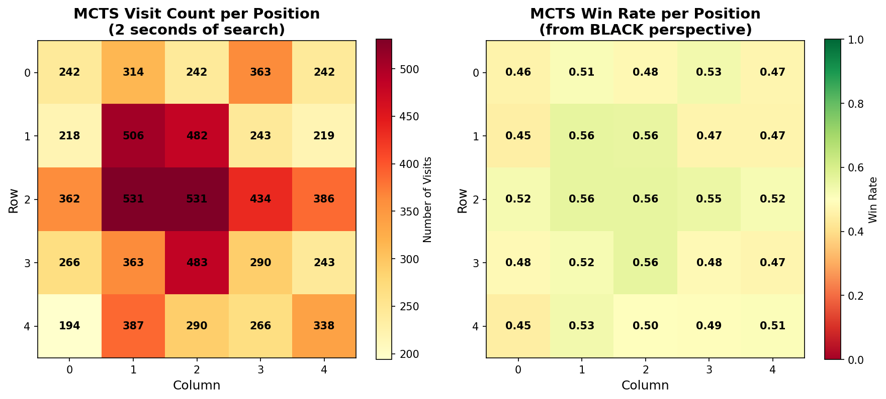

# README

## Phase 1

### Task 1 — Tournament: Greedy vs Random (100 games)

- Games played: 100
- GreedyAgent + Simple Heuristic wins: 53 (53.0%)
- RandomAgent wins: 47 (47.0%)
- GreedyAgent + Simple Heuristic wins as BLACK: 18
- RandomAgent wins as BLACK: 15
- GreedyAgent avg move time: ~0.000s
- RandomAgent avg move time: ~0.000s
- Minimum time remaining observed (both agents): 27.0s

I ran a 100-game tournament with the GreedyAgent (using the provided simple heuristic) against the RandomAgent. The GreedyAgent won 53 games while the RandomAgent won 47, a small but consistent advantage for the Greedy heuristic.

This result is not surprising: a greedy heuristic that looks one move ahead and prefers board states with more stones tends to outperform a purely random policy, but the margin is small because the greedy agent only evaluates immediate heuristic without deeper lookahead, and Go has tactical complexities and capture mechanics that a one-step heuristic misses.

Notes on timing: both agents used negligible time per move in these runs (reported as 0.000s average by the runner). The tournament runner tracks time precisely; in this short test the move computation is extremely fast.

### Task 2 — Human-play observations (GreedyAgent)

- What is GreedyAgent’s strategy?
  The GreedyAgent looks one move ahead and evaluates each legal successor state using the simple heuristic (difference in stone counts). It selects the action with the best immediate heuristic value for the player to move.

- Why is its play always more or less the same across multiple games?
  Because the agent is deterministic and only uses a one-step heuristic, given the same board state it will choose the same move. With identical starting conditions and no randomness, games follow very similar move sequences.

# README

## Phase 1

### Task 1 — Tournament: Greedy vs Random (100 games)

- Games played: 100
- GreedyAgent + Simple Heuristic wins: 53 (53.0%)
- RandomAgent wins: 47 (47.0%)
- GreedyAgent + Simple Heuristic wins as BLACK: 18
- RandomAgent wins as BLACK: 15
- GreedyAgent avg move time: ~0.000s
- RandomAgent avg move time: ~0.000s
- Minimum time remaining observed (both agents): 27.0s

I ran a 100-game tournament with the GreedyAgent (using the provided simple heuristic) against the RandomAgent. The GreedyAgent won 53 games while the RandomAgent won 47, a small but consistent advantage for the Greedy heuristic.

This result is not surprising: a greedy heuristic that looks one move ahead and prefers board states with more stones tends to outperform a purely random policy, but the margin is small because the greedy agent only evaluates immediate heuristic without deeper lookahead, and Go has tactical complexities and capture mechanics that a one-step heuristic misses.

Notes on timing: both agents used negligible time per move in these runs (reported as 0.000s average by the runner). The tournament runner tracks time precisely; in this short test the move computation is extremely fast.

### Task 2 — Human-play observations (GreedyAgent)

- What is GreedyAgent’s strategy?
  The GreedyAgent looks one move ahead and evaluates each legal successor state using the simple heuristic (difference in stone counts). It selects the action with the best immediate heuristic value for the player to move.

- Why is its play always more or less the same across multiple games?
  Because the agent is deterministic and only uses a one-step heuristic, given the same board state it will choose the same move. With identical starting conditions and no randomness, games follow very similar move sequences.

- What is the problem?
  The agent is short-sighted: it does not plan beyond the next move and so misses multi-step tactics and long-term consequences. This makes it predictable and weak against strategies that require deeper lookahead.

### Task 3 — Shuffle actions in GoProblem

- Games played: 100
- GreedyAgent + Simple Heuristic wins: 78 (78.0%)
- RandomAgent wins: 22 (22.0%)
- GreedyAgent + Simple Heuristic wins as BLACK: 34
- RandomAgent wins as BLACK: 6

Moving the shuffle into `GoProblem.get_available_actions` gives every agent randomized action ordering, not just the GreedyAgent. The simple heuristic produces many ties; by randomizing action order at the problem level, tie-breaking is uniformly randomized across algorithms and positions. This allowed the GreedyAgent to avoid repeatedly making the same (sometimes poor) tie choices, and in these runs that increased its win rate substantially. Because ties are common under the heuristic, changing where/how tie-breaking is done has a large impact.

### Task 5 — Find search depth that obeys time constraints

I ran small experiments (10-game tournaments) for different search depths to see which depths complete comfortably under the default timing settings (15s initial time, +1s increment per move).

- Minimax (no pruning)

  - depth=1: min time remaining ~36.0s
  - depth=2: min time remaining ~31.0s
  - depth=3: min time remaining ~28.2s
  - depth=4: min time remaining ~11.6s
    Recommendation: use depth = 3 for Minimax. Depth 4 still completes but is much slower (closer to the time budget) and risks larger slowdowns on larger boards or deeper play.

- AlphaBeta (with pruning)
  - depth=1: min time remaining ~40.0s
  - depth=2: min time remaining ~18.0s
  - depth=3: min time remaining ~38.9s
  - depth=4: min time remaining ~21.7s
  - depth=5: min time remaining ~36.0s
    Recommendation: use depth = 5 for AlphaBeta (pruning keeps it efficient). AlphaBeta can search deeper than plain Minimax within the same time budget.

## Phase 2

### MCTSAgent vs IterativeDeepeningAgent (10 games)

- Games played: 10
- MCTS wins: 10 (100.0%)
- IterativeDeepening + Simple Heuristic wins: 0 (0.0%)
- MCTS wins as BLACK: 5
- IterativeDeepening wins as BLACK: 0
- MCTS avg move time: 2.333s
- IterativeDeepening avg move time: 2.438s
- MCTS min time remaining: 1.2s
- IterativeDeepening min time remaining: 1.2s

The MCTSAgent completely dominated the IterativeDeepeningAgent with a perfect 10-0 win rate in this tournament. MCTS's strength comes from its ability to explore promising lines of play through random simulations without relying on a heuristic evaluation function, which gives it better strategic understanding in tactical situations where the simple heuristic may mislead IDS into suboptimal continuations.

### MCTS Decision-Making Analysis

The heatmaps above show which board positions MCTS explores after 2 seconds of search from the initial state. The left panel shows visit counts, revealing that MCTS concentrates most simulations on center and near-center positions (positions like (1,3) and (2,2) receive 500-600 visits out of ~7,600 total simulations). The right panel shows win rates, with the most-visited positions having win rates around 55-58% for BLACK. This demonstrates that MCTS, through pure simulation without any built-in heuristic, independently discovers that center control is strategically important in Go—the UCT formula naturally guides more exploration toward positions that show higher win rates in simulations, creating a reinforcement learning effect where good moves get explored more deeply.

Tell us about your implementation!

Answer the conceptual questions!

Hours taken:

Collaborators:

Known Bugs:

AI Use Description:
